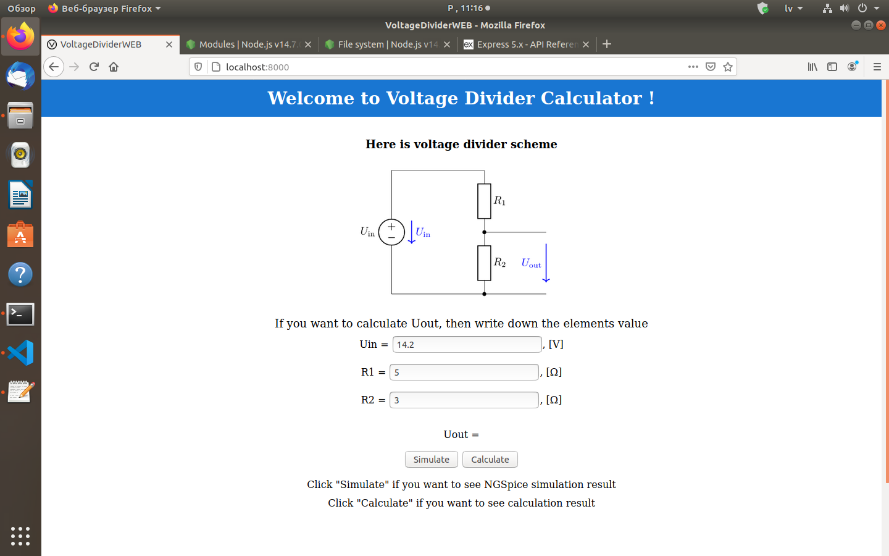
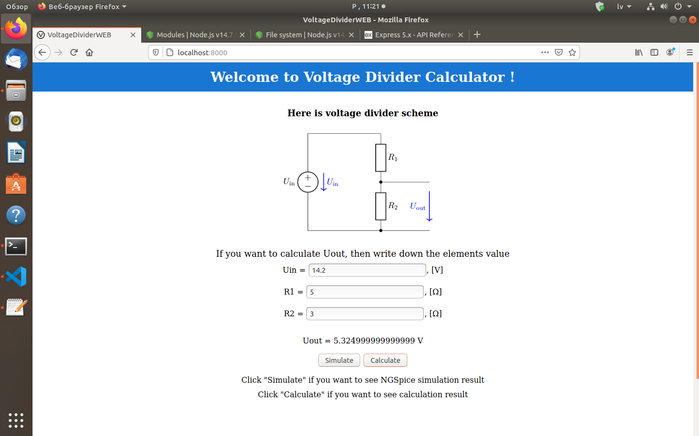

# Spriegums dalītāja kalkulators
Kā gala projekts, man vajadzēja izvedot web servissu, kurš kalkulē izejas sprieguma vērtību pēc sprieguma dalītāja shēmas, izmantojot NGSpice un izejas sprieguma formulu.  
Sākumā es cīnījos ar Angular framework-u, jo 15. nodarbībā es jau biju ar to pazīstams, bet galu galā man nekas īsti labs nesanaca, jo Angulara valoda ir TypeScript, kuru se diemžēl vēl nezinu, un, piemēram, katru JavaScript failu vajadzēja pievienot "Script" daļai failā angular.json, kā arī saprast, kā vispar var to failu pasaukt utt. Tas man aizņēma daudz laika, tāpēc es izmantoju express framework-u, ar kuru mēs arī 15. nodarbībā varējam iepazīties, kurš man liekas ir vieglāks saprašanai.  
Express framework-s - ir Node.js framework-s, kuru var izmantot web servissa veidošanai.  
Izmantojot <b>"https://expressjs.com/en/5x/api.html"</b> un <b>"https://nodejs.org/api/documentation.html"</b> dokumentācijas, es sāku veidot savu pirmo web servissu.  
Lai palaistu web servissu, vajag konsolē uzrakstīt:
>  
> node voldiv.js
>  
<b>"voldiv.js"</b> fails, kurš ir uzrakstīts JavaScript valodā, kuru es apguvu 13. nodarbībā.
Kā arī mums ir vajadzīgs <b>index.html</b> fails, kurš ir uzrakstīts html valodā - iezīmēšanas valodā, kas ir izstrādāta tīmekļa lappušu un citas pārlūkprogrammā attēlojamas informācijas glabāšanai, kuru es apguvu 12. nodarbībā.  
Pēc web serviss palaišanas, mūsu mājaslapa izskatīsies šādi:
>  
> 
>  
Mans galvenais mērķis bija izveidot strādājošu web servissu, tāpēc mājaslapas izskats ir mazliet "vienkāršs".  
Mājaslapas tekstu es uzrakstīju angļu valodā un sprieguma dalītāja shēmu es paņēmu no 10.-11. nodarbības LaTeX dokumenta.  
Kā arī Uin, R1 un R2 vērtības es paņēmu no 9. nodarbības.  
Ja uzspiest pogu <b>"Calculate"</b>, tad uz ekrāna būs rezultāts, kurš ir aprēķināts izmantojot izejas spieguma formulu:  
>  

>  
Ja uzspiest pogu <b>"Simulate"</b>, tad uz ekrāna būs rezultāts, kurš ir iegūts izmantojot NGSpice simulāciju:  
>  

>  
Lai iegūtu NGSpice simulācijas rezultātus, lietotāja ievadīti dati tiek saglabāti un nosutīti uz serveri, kur notiek .net faila izvedošana un ngspice simulācija, un pēc tam simulācijas rezultāti tiek nosūtīti lietotājam. Tas viss notiek ar JSON palīdzību.  
Šo ideju es paņēmu no ārzemju studentu prezentācijām, kuri ir pieejami ORTUS-ā.  
## Secinājums
Secinājumā, gribēju pateikt, ka web serviss strādā un bija ļoti interesanti pamēģināt izveidot savu pirmo web servissu! Arī lai tās būtu pieejams pasaulē, piemēram, varam izmantot <b>ngrok</b>, kuru mēs apguvam 14. nodarbībā. Kā arī man gribētos brīvā laikā atkal "pacīnīties" ar Angular un pamēģināt izveidot web servissu tur.
