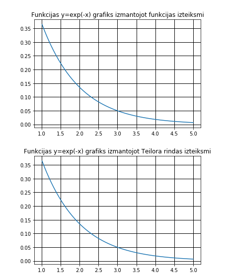

# Jupyter notebook. iPynb
Nodarbībā Nr.5 es iepazinos ar to, kā izmantot Jupyter notebook un kā tur noformēt dokumentus.

## Teilora rindas
Es izmantoju 1. semestra failu Teilora rindas, kurš ir uzrakstīts C valoda, un pārrakstīju to uz Python valodu un noformēju dokumentu Jupyter notebook-ā.  
Izmantojot <b>matplotlib</b> es uzrakstīju kodu, kurš zīmē divus funkcijas y=exp(-x) grafikus: 1 - izmantojot funkcijas izteiksmi; 2 - izmantojot Teilora rindas izteiksmi.  
Piemēram es izvelējos uzzīmēt grafikus robežās no 1 līdz 5. Matplotlib uzzīmēs man sekojošus grafikus:  
>  

>  

