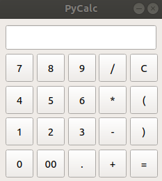
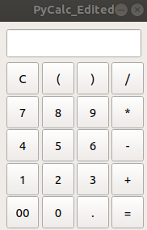

# GUI PyQt5 PyCalc veidošana
Nodarbībā Nr.7 es izveidoju kalkulatoru, izmantojot https://realpython.com/python-pyqt-gui-calculator/ mājaslapu un pēc tam izdarīju nelielas izmaiņas.

## Kalkulators no realpython.com
Pirmkārt, es izvedoju kalkulatoru no realpython.com, kurš izskatās :  
>  
  
Pēc tam es nolēmu to mazliet pārtaisīt, izmainījot loga izmērus:  
>  
>self.setFixedSize(235, 235)  
>  
Nomainīju uz:  
>  
>self.setFixedSize(185, 260)  
>  
Kā arī nomainīju pogas atrašanas vietu, lai tās apmērām izskatās kā kalkulatorā manā telefonā:  
>  
>buttons = {"7": (0, 0),  
>           "8": (0, 1),  
>           "9": (0, 2),  
>           "/": (0, 3),  
>           "C": (0, 4),  
>           "4": (1, 0),  
>           "5": (1, 1),  
>           "6": (1, 2),  
>           "*": (1, 3),  
>           "(": (1, 4),  
>           "1": (2, 0),  
>           "2": (2, 1),  
>           "3": (2, 2),  
>           "-": (2, 3),  
>           ")": (2, 4),  
>           "0": (3, 0),  
>           "00": (3, 1),  
>           ".": (3, 2),  
>           "+": (3, 3),  
>           "=": (3, 4),  
>           }  
>  
Nomainīju uz:  
>  
>buttons = {"7": (1, 0),  
>           "8": (1, 1),  
>           "9": (1, 2),  
>           "/": (0, 3),  
>           "C": (0, 0),  
>           "4": (2, 0),  
>           "5": (2, 1),  
>           "6": (2, 2),  
>           "*": (1, 3),  
>           "(": (0, 1),  
>           "1": (3, 0),  
>           "2": (3, 1),  
>           "3": (3, 2),  
>           "-": (2, 3),  
>           ")": (0, 2),  
>           "0": (4, 1),  
>           "00": (4, 0),  
>           ".": (4, 2),  
>           "+": (3, 3),  
>           "=": (4, 3),  
>           }  
>  
Galu galā tās izskatās šādi:  
>  

