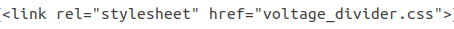
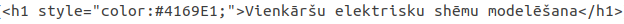

# HTML un CSS
Nodarbībā Nr.12 es iepazinos ar HTML un CSS. Lai uzzinātu vairāk par HTML un CSS, es izmantoju w3schools.com mājaslapu. Šajā nodarbībā es pārrakstīju savu LaTeX projektu no nodarbības Nr.10-11 uz HTML. Bildes es pievienoju ar linkiem uz github-u. Shēmas zīmēšanai es izmantoju JavaScript, kurš ir uzrakstīts paša apakšā. Lai uzrakstītu matemātiskas izteiskmes, es izmantoju MathJax.  
CSS piemēri:  
Internal:  
>  
> td, th {  
>   border: 2px solid black;  
>   text-align: center;  
>   padding: 3px;  
>	}  
>  
td un th ir saistīti ar tabulas veidošanu  
External:  
>  

>  
Kurš norāda uz ārējo .css failu  
Inline:  
>  

>  
Tiek izmantots lai nomainītu virsraksta krāsu  
