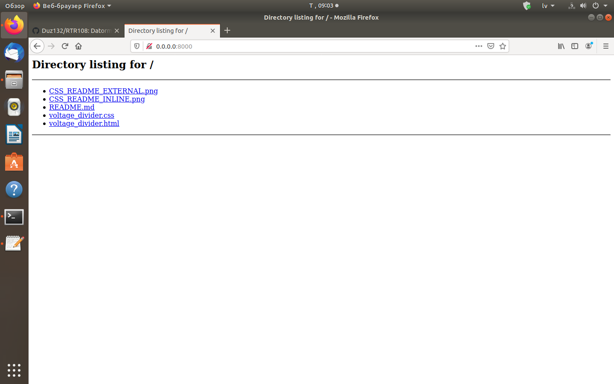
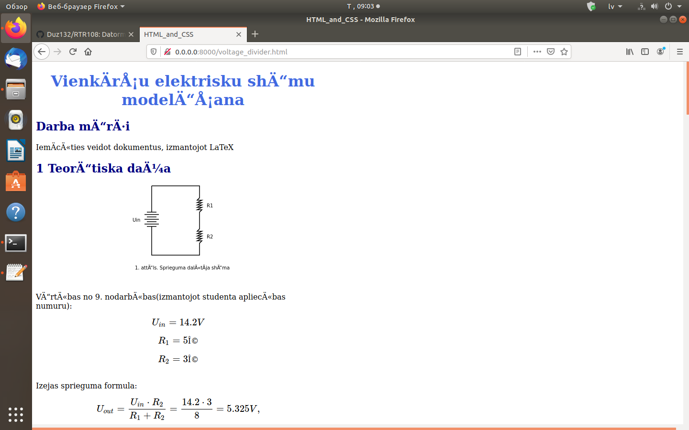
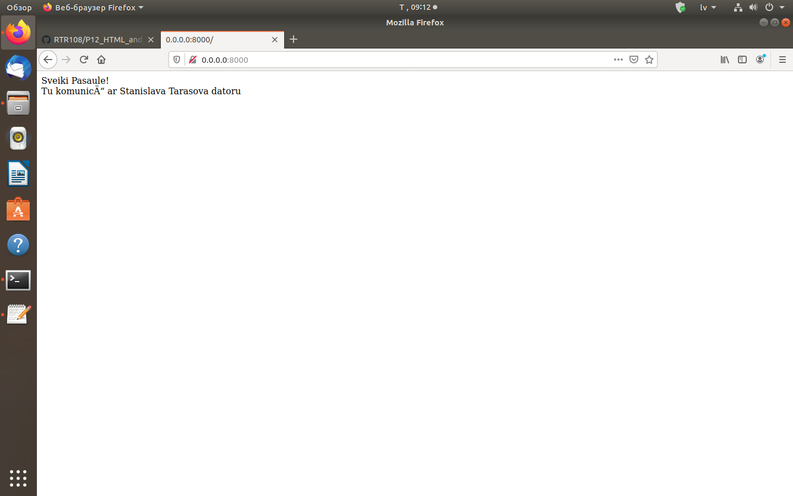
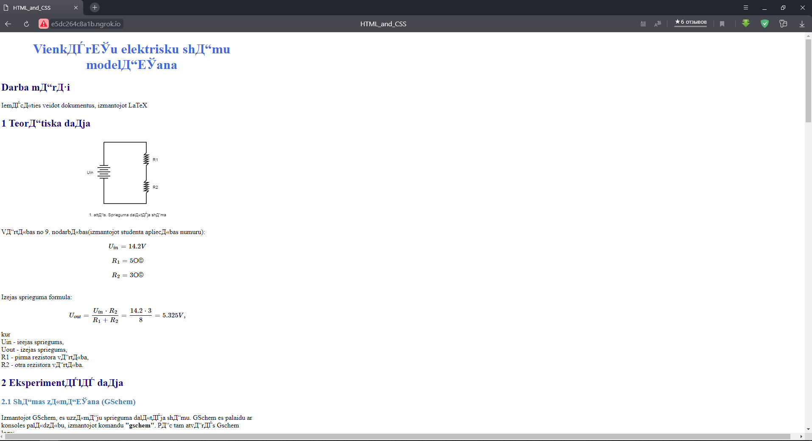

# SimpleHTTPServer web serviss un ngrok
Nodarbībā Nr.14 es iepazinos ar SimpleHTTPServer moduli un ngrok izmantošanu.  
Lai palaist SimpleHTTPServer moduli vajag konsolē uzrakstīt:  
>  
> python -m SimpleHTTPServer 8000  
>  
Kad es palaižu serveri, es biju savā direktorijā P12_HTML_and_CSS. Pēc servera palaišanas es redzēju savas direktorijas saturu un kā piemēru atvēru savu HTML voltage_divider.html darbu:  
>  

>  
>  

>  
Bet, ja direktorijā būs fails index.html, tad pēc servera palaišanas es redzēšu index.html faila saturu. Kā piemērs, es izvedoju index.html failu RTR108 direktorijā un palaidu serveri:  
>  

>  
Izmantojot ngrok šo serveri var atvert attalināti. Kā piemērs, es biju savā direktorijā P12_HTML_and_CSS un atvēru savu HTML failu gan savā browser-ā, gan citā:  
>  

>  
>  

>  
