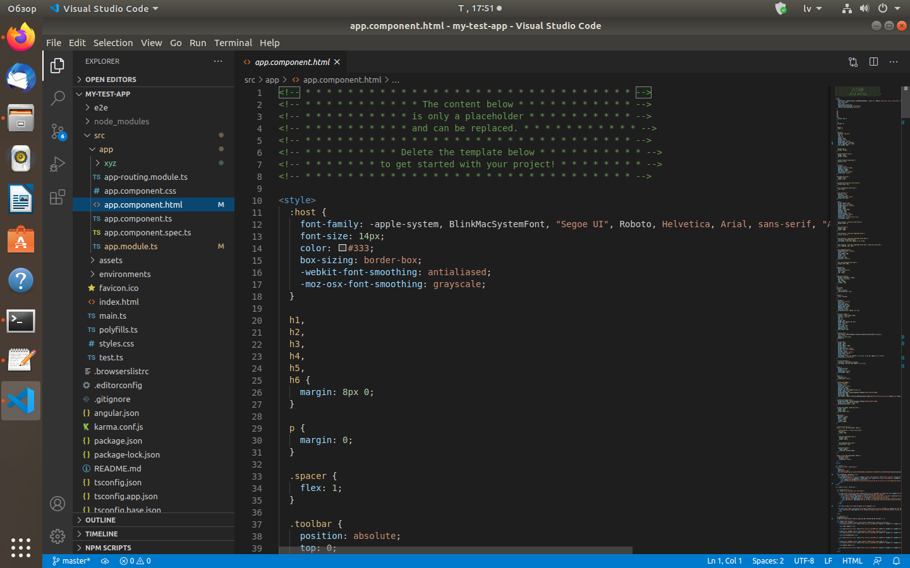
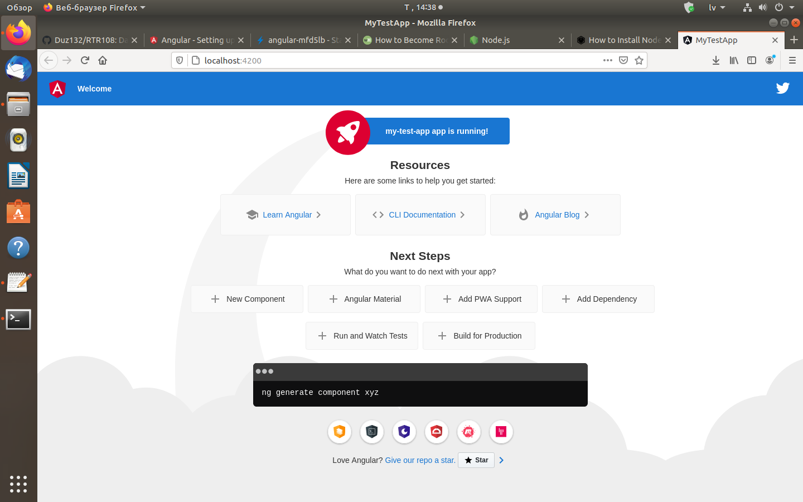
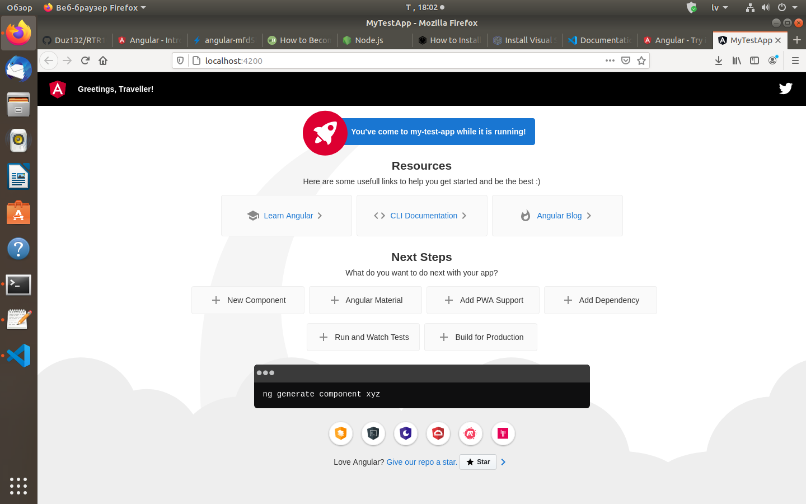

# Frameworks
Nodarbībā Nr.15 es iepazinos ar Angular frameworku, kā to installēt un strādāt ar viņu.  
Pēc Angular installēšanas, mēs varam sākt strādāt. Pirmkārt, vajag izveidot jaunu projektu:  
>  
> ng new [projekta_nosaukums]  
>  
Pēc tam tās pajautās, kādu no 4 stila valodiem mēs izmantosim. Es izvelējos CSS.  
Galu galā mums izveidosies jauna mape ar mūsu jaunu projektu. Ieejot tajā mapē, mēs varam sākt strādāt. Lai rediģētu kodu es izmantoju Visual Studio Code. Mēs to varam palaist ar komandu:  
>  
> code  
>  
Visual Studio Code logs izskatīsies šādi:  
>  

>  
Pēc mūsu veiktajam izmaiņam, mēs varam palaist framework-u lokāli ar komandu:  
>  
> ng serve --open  
>  
Mūsu jauns projekts bez koda izmaiņam aptuveni izskatīsies šādi:  
>  

>  
Es izdarīju nelielas izmaiņas tekstā un nomainīju augšā paneļa krāsu:  
>  

>  
