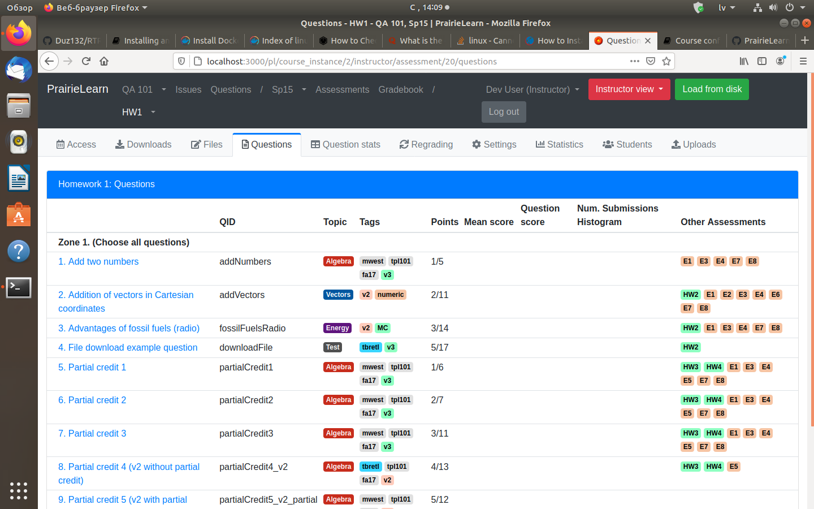

# PrairieLearn
Nodarbībā Nr.16 es iepazinos ar PrairieLearn vidi.  
Pēc vides installēšanas, mēs varam sākt strādāt. Pirmkārt, vajag palaist vidi, piemēram ar komandu:  
>  
> sudo docker run -it --rm -p 3000000 prairielearn/prairielearn  
>  
Kad vide ir palaista, mēs varam tai piekļaut ar:
>  
> localhost:3000/pl  
>  
Mums automātiski būs administratora privilēģijas ar kuram mēs varam izveidot jaunas tēmas, jautājumu, testus vai eksāmenus. Pēc pirmas palaišanas vide bija papildināta ar automatizētiem testēšanas kursiem. Vide apskatīsies dažādi studentam un pasniedzējam. Tā vide apskatīsies pasniedzējam:  
>  

>  
Tā vide apskatīsies studentam:  
>  

>  
Arī pasniedzējs var redzēt studenta tēmas izpildīšanas procentuāli:  
>  

>  
## Jaunas tēmas un uzdevuma izveidošana
Pēc jaunas tēmas un uzdevuma izveidošanas, vajag papildināt tēmu ar uzdevumu, kuru mēs jau izveidojam:  
>  

>  
Kad es izveidoju jaunu uzdevumu, uzdevumā parādās automātiskik izveidotais uzdevums. Es viņu nemainīju, pamainīju tikai tekstu, lai tās būtu uzrakstīts latviski:  
>  

>  
Lai uzdevums strādātu ir izveidots fails server.py, kur jau ir uzrakstīts uzdevuma kods (ģenerēt 2 random ciparus no 5 līdz 10, summēt tos un pareizu atbildi ienest 'correct_answers'):  
>  

>  
Galu galā students redzēs jaunu tēmu un uzdevumu šādi:  
>  

>  
>  

>  
